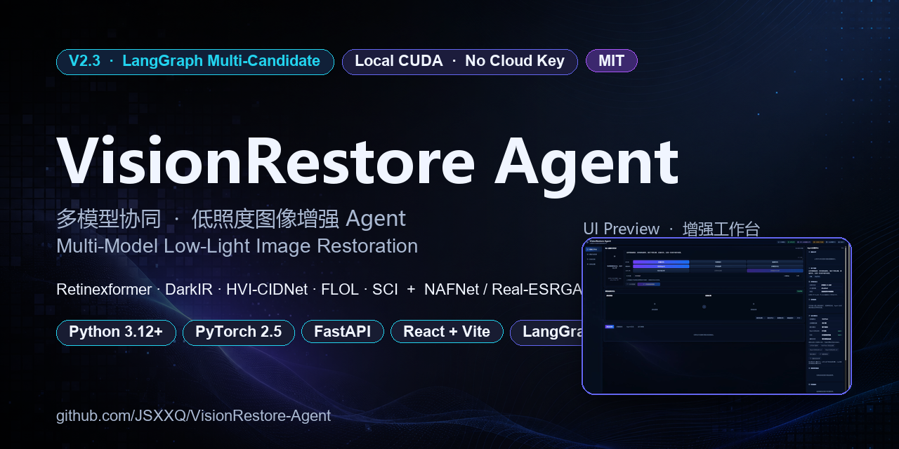
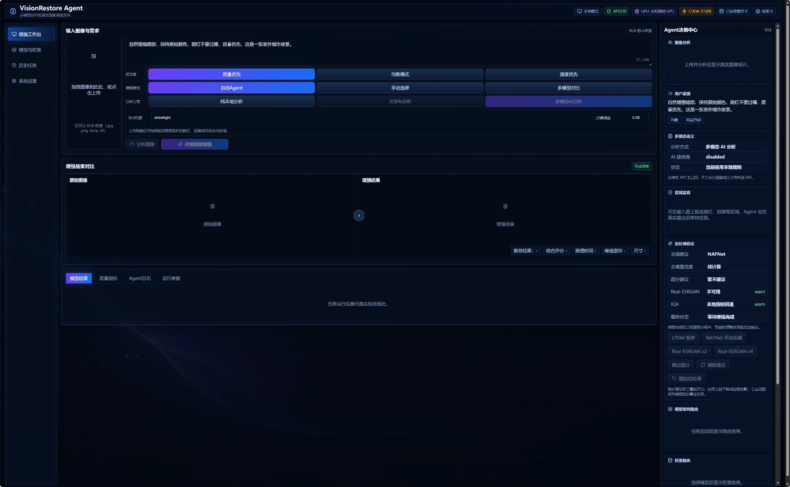
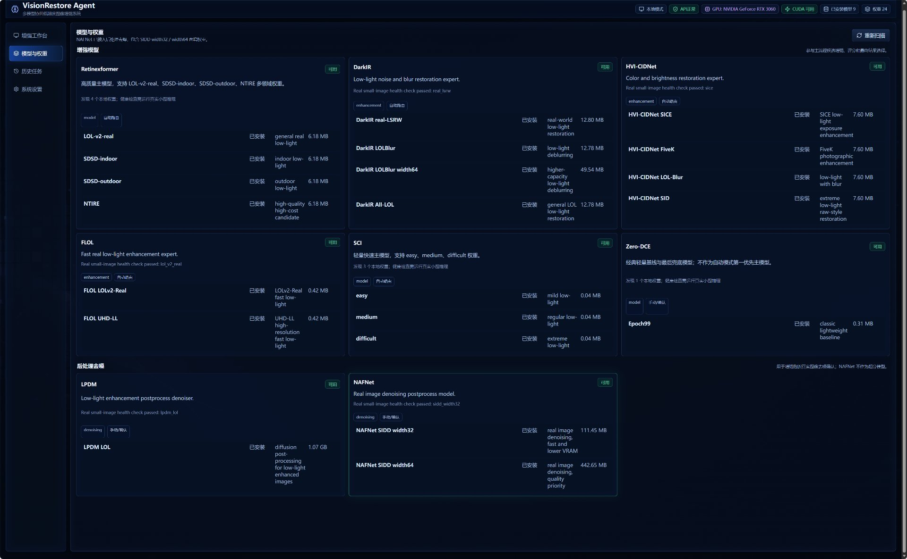
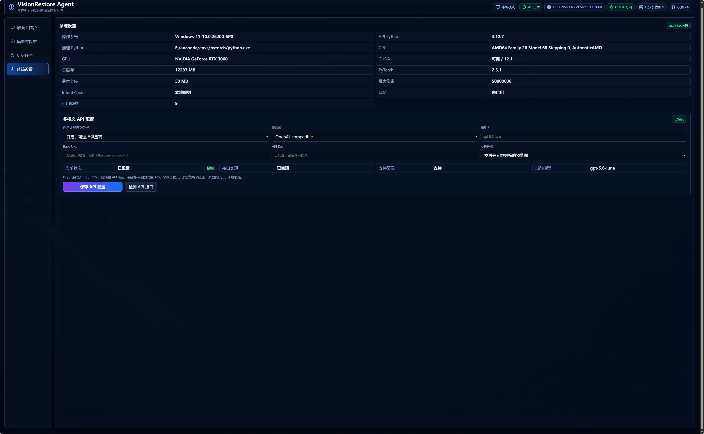

<div align="center">



<br/>

[](LICENSE)
[](CHANGELOG.md)
[](https://www.python.org/)
[](https://pytorch.org/)
[](https://developer.nvidia.com/cuda-toolkit)
[](https://fastapi.tiangolo.com/)
[](https://react.dev/)
[](https://langchain-ai.github.io/langgraph/)
[](#-quick-start)
[](#-quick-start)

</div>

---

## ✨ What is VisionRestore Agent?

A **LangGraph-orchestrated, multi-candidate low-light image restoration agent** that runs **100% locally** on your GPU — no cloud API key, no telemetry, no upload.

Instead of picking one model up front, it plans **1–3 complementary candidates** per request, runs them on the original image in parallel, scores the *real* outputs, and only then selects the best result. If post-processing is needed, it pauses for your confirmation before invoking NAFNet (denoise) or Real-ESRGAN (super-resolution).

> 📘 **Read this first:** [Quick Start](#-quick-start) · [中文文档](README.md) · [Architecture Deep Dive](docs/architecture.md)

---

## 🎯 Why this is different

| Other tools | VisionRestore Agent V2.3 |
|---|---|
| Single fixed model | **Multi-candidate fan-out**, scored on real outputs |
| Black-box decision | Deterministic two-level routing + per-step state machine |
| Cloud inference | **Local CUDA only** — your image never leaves the machine |
| Optional: any open key | Provider-agnostic AI for advisory analysis (disabled by default) |
| Single language | Mixed **CN + EN** UI, prompts, and reports |
| Hard-coded super-resolution | **Interrupt / resume** for human-confirmed postprocess |

---

## 🖼️ Screenshots

<div align="center">

### 🛠️ 增强工作台 · Workbench

<sub>Upload → describe intent → multi-model fan-out → side-by-side compare → best result. The whole loop is auditable.</sub>

<br/><br/>

### 🧠 模型与权重 · Model Center

<sub>10 worker modules, 24 checkpoints. Health-checked, weight-reported, and selectively routed by the planner.</sub>

<br/><br/>

### ⚙️ 系统设置 · System Settings

<sub>Live hardware / CUDA / PyTorch / Intent parser / LLM status. Configure multimodal providers without leaking keys to the frontend.</sub>

</div>

---

## 🧠 Architecture (V2.3)

```
┌──────────────────────────────────────────────────────────────────────┐
│   User Request → ImageAnalyzer → IntentParser → Hardware Inspector  │
│                          │                                          │
│                          ▼                                          │
│          CandidatePlanner  (local + knowledge + AI bonus)            │
│                          │                                          │
│            ┌─────────────┼─────────────┐                            │
│            ▼             ▼             ▼                            │
│         Worker A       Worker B       Worker C    (parallel, real)  │
│            │             │             │                            │
│            └─────────────┼─────────────┘                            │
│                          ▼                                          │
│     CandidateEvaluator → CandidateRanker → ResultSelector           │
│                          │                                          │
│                          ▼                                          │
│   ResidualDegradationAnalyzer → [interrupt] → NAFNet / Real-ESRGAN  │
│                          │                                          │
│                          ▼                                          │
│                  Final result + lineage                              │
└──────────────────────────────────────────────────────────────────────┘
```

Full data-flow diagram: [docs/diagrams/visionrestore_v22_dataflow.png](docs/diagrams/visionrestore_v22_dataflow.png)

Key invariants:

- **Every candidate reads the same original input** — no serial enhancement chains.
- **`final_score` comes from real outputs only** — knowledge is bounded to `[-5, +5]` and never enters the final score.
- **Manual model selection is unadjusted** — knowledge and AI bonus only nudge automatic-mode candidates.
- **Postprocess is opt-in** — denoise / super-resolution require your explicit confirmation; bad rollbacks are auto-reverted.

See [docs/agent_workflow.md](docs/agent_workflow.md) for the full 22-state machine.

---

## 🧩 Model Matrix

| Category | Worker | Status | Weights / Variants |
|---|---|---|---|
| Enhancement | **Retinexformer** | ✅ Real inference | LOL-v2-real · SDSD-indoor · SDSD-outdoor · NTIRE |
| Enhancement | **DarkIR** | ✅ Real inference | real-lol · LOLBlur · LOLBlur width64 · AR-LOL |
| Enhancement | **HVI-CIDNet** | ✅ Real inference | SiCe · FiveK · LOLBlur · SID |
| Enhancement | **FLOL** | ✅ Real inference | LOLv2-Real · UHD-LL |
| Enhancement | **SCI** | ✅ Real inference | easy · medium · difficult |
| Manual / baseline | **Zero-DCE** | ✅ Real inference | Epoch99 (legacy, not in auto pool) |
| Postprocess (manual) | **NAFNet** | ✅ Real inference | SIDD width32 · SIDD width64 (denoise) |
| Postprocess (manual) | **Real-ESRGAN** | ✅ Real inference | v2 (anime / photo) · v4 (photo) |
| Auxiliary (degraded) | **LPDM** | ⚠️ Real inference (limited checks) | LOL |
| Auxiliary (degraded) | **MambaIR** | ⛔ Source not vendored | — |

Knowledge and AI bonuses can adjust which model is preferred, but they **cannot** introduce a new model into the candidate pool — only models that pass the local registry + checkpoint + auto-route + hardware checks are eligible.

---

## 🚀 Quick Start

> **Requirements:** Windows 10/11 · Python 3.12+ · CUDA-capable GPU (RTX 3060 12 GB verified) · Node.js 20+ · Git

```powershell
# 1. Clone
git clone https://github.com/JSXXQ/VisionRestore-Agent.git
cd VisionRestore-Agent

# 2. One-command start (creates venv, installs deps, starts API + Web)
powershell -NoProfile -ExecutionPolicy Bypass -File scripts\start.ps1

# 3. Open the UI
#    Web UI  : http://127.0.0.1:5173
#    API     : http://127.0.0.1:8000
#    Swagger : http://127.0.0.1:8000/docs
```

> **No model weights are shipped in the repo.** On first run the system runs `scripts\download_models.ps1` and reads your local paths from `config\models.local.yaml` (gitignored). See [docs/model_download_checklist.md](docs/model_download_checklist.md) and [docs/model_environment_isolation.md](docs/model_environment_isolation.md).

Stop the stack:

```powershell
powershell -NoProfile -ExecutionPolicy Bypass -File scripts\stop.ps1
```

---

## 🧪 Verify your install

```powershell
# Hardware / Python / CUDA / PyTorch check
powershell -NoProfile -ExecutionPolicy Bypass -File scripts\check_environment.ps1

# Real-inference smoke test against your weights
powershell -NoProfile -ExecutionPolicy Bypass -File scripts\validate_models.ps1

# Full Python test suite
.\.venv\Scripts\python.exe -m pytest
```

Latest local verification (RTX 3060 12 GB, PyTorch 2.5.1, CUDA 12.1):

- Retinexformer LOL-v2-real · SDSD-outdoor · ✔
- DarkIR real-lol · ✔
- HVI-CIDNet SiCe · ✔
- FLOL LOLv2-Real · ✔
- SCI medium · ✔
- Zero-DCE Epoch99 · ✔
- NAFNet SIDD width32 (denoise postprocess) · ✔
- Real-ESRGAN v2 (super-resolution postprocess) · ✔

---

## 🔌 CLI

```powershell
# Analyze an image (no model call)
.\.venv\Scripts\python.exe -m visionrestore.cli analyze `
    --input data\cache\test_images\low_light.png

# Enhance via automatic V2 (multi-candidate)
.\.venv\Scripts\python.exe -m visionrestore.cli enhance `
    --input input.jpg `
    --request "自然增强暗部，保护高光，质量优先" `
    --mode auto `
    --output output.png

# Enhance with manual model + checkpoint
.\.venv\Scripts\python.exe -m visionrestore.cli enhance `
    --input input.jpg `
    --model retinexformer --weight lol_v2_real `
    --output output.png

# Compare multiple candidates side-by-side
.\.venv\Scripts\python.exe -m visionrestore.cli compare `
    --input input.jpg `
    --output compare.png `
    --candidates retinexformer:lol_v2_real retinexformer:sdsd_outdoor sci:difficult
```

---

## 🌐 API surface (selected)

```
GET  /api/v1/health
GET  /api/v1/system
GET  /api/v1/models
GET  /api/v1/models/{model}/weights
POST /api/v1/intent/parse
POST /api/v1/images
POST /api/v1/tasks            # create -> task_id
GET  /api/v1/tasks/{id}        # poll / WebSocket
GET  /api/v1/history
GET  /api/v1/files/{id}
GET  /api/v1/settings
PUT  /api/v1/settings

# Optional multimodal advisory (disabled by default)
GET  /api/v1/ai/providers
POST /api/v1/ai/providers/{provider_id}/health-check
POST /api/v1/ai/analyze
GET  /api/v1/ai/settings
PUT  /api/v1/ai/settings
POST /api/v1/ai/test
```

Provider slots: `disabled` · `openai` · `openai_compatible` · `anthropic` · `gemini`. Full keys are written to local `.env` and **never** returned to the frontend.

---

## 📚 Documentation map

| Topic | Doc |
|---|---|
| V2 multi-candidate workflow (22 states) | [docs/agent_workflow.md](docs/agent_workflow.md) |
| LangGraph refactor & checkpoints | [docs/langgraph_refactor_report.md](docs/langgraph_refactor_report.md) |
| Deterministic two-level routing | [docs/hierarchical_routing.md](docs/hierarchical_routing.md) |
| Candidate planning & scoring | [docs/multi_candidate_planning.md](docs/multi_candidate_planning.md) |
| Model adapter contract | [docs/model_adapter.md](docs/model_adapter.md) |
| Postprocess controller | [docs/postprocess_workflow.md](docs/postprocess_workflow.md) |
| No-reference IQA integration | [docs/iqa_integration.md](docs/iqa_integration.md) |
| Region constraints (streetlight, etc.) | [tests/test_region_constraints.py](tests/test_region_constraints.py) |
| Multimodal AI providers | [docs/multimodal_ai.md](docs/multimodal_ai.md) |
| Model environment isolation | [docs/model_environment_isolation.md](docs/model_environment_isolation.md) |
| Security & upload hardening | [docs/security.md](docs/security.md) |
| Troubleshooting | [docs/troubleshooting.md](docs/troubleshooting.md) |
| V2.2 → V2.3 轻量知识增强 | [docs/VisionRestore_Agent_V2.2_重构与轻量知识增强报告.docx](docs/VisionRestore_Agent_V2.2_重构与轻量知识增强报告.docx) |

中文版完整文档：[README.md](README.md)。

---

## 🛣️ Roadmap

- ✅ **V2.0** — LangGraph multi-candidate orchestration with persistent checkpoints
- ✅ **V2.1** — Hierarchical routing, deterministic scoring, IQA integration
- ✅ **V2.2** — Region constraints, residual analyzer, manual postprocess controller
- ✅ **V2.3** — Lightweight knowledge enhancement, NAFNet + Real-ESRGAN postprocess, provider-agnostic multimodal AI
- 🔜 **V2.4** — WebP / AVIF pipeline, larger-tile super-resolution fusion, automated test expansion toward 20 categories

---

## 🤝 Contributing

PRs and issues are welcome. Before opening one, please:

1. Read [docs/architecture.md](docs/architecture.md) and [docs/agent_workflow.md](docs/agent_workflow.md).
2. Use the provided issue templates in [`.github/ISSUE_TEMPLATE/`](.github/ISSUE_TEMPLATE/).
3. Make sure `./.venv/Scripts/python.exe -m pytest` stays green and the Web build (`npm.cmd run build --prefix apps\web`) passes.

If you're adding a new model worker, follow the contract in [docs/model_adapter.md](docs/model_adapter.md) — your worker must read the **original input** and emit a real output whose score is computed by `CandidateEvaluator`, not by the planner.

---

## 📜 License

[MIT](LICENSE) — see also [THIRD_PARTY_NOTICES.md](THIRD_PARTY_NOTICES.md) for the licenses of vendored model code and weights (Retinexformer, SCI, Zero-DCE, etc.). Their original non-commercial / research-use terms still apply at the source level.

---

## 🙏 Acknowledgments

This project stands on the shoulders of the following open-source work. Please cite the original papers if you use the corresponding weights:

- **Retinexformer** — Cai et al., *Retinexformer: One-stage Retinex-based Transformer for Low-light Image Enhancement*, ICCV 2023.
- **SCI** — Ma et al., *Toward Fast, Flexible, and Robust Low-Light Image Enhancement*, CVPR 2022.
- **Zero-DCE** — Guo et al., *Zero-Reference Deep Curve Estimation for Low-Light Image Enhancement*, CVPR 2020.
- **DarkIR**, **HVI-CIDNet**, **FLOL**, **NAFNet**, **Real-ESRGAN**, **LPDM**, **MambaIR** — see [THIRD_PARTY_NOTICES.md](THIRD_PARTY_NOTICES.md).

---

<div align="center">

<sub>Built with ❤️ on Windows · Verified on RTX 3060 12 GB · No image ever leaves your machine</sub>

</div>
