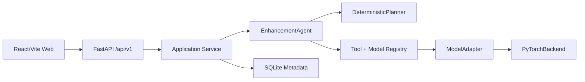
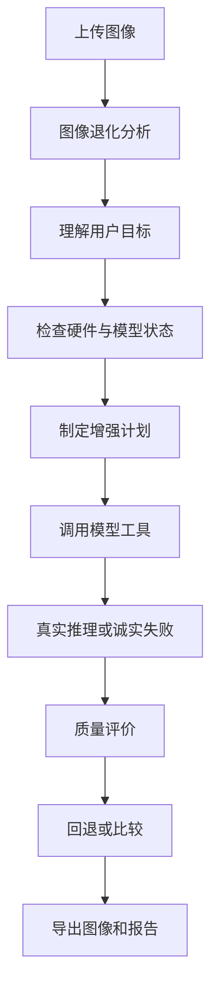

# VisionRestore Agent

多模型协同低照度图像增强 Agent。本项目只处理普通 RGB 静态图像，不包含事件相机、视频、连续帧、音频或时序相关功能。

## 核心功能

- 本地 FastAPI REST API 与 React/Vite 网页工作台。
- 安全上传 png、jpg、jpeg、bmp、tif、tiff。
- 图像亮度、暗区、过曝、噪声、清晰度、色偏、动态范围等统计分析。
- 确定性 Agent：分析图像、理解用户目标、检查硬件、选择模型、执行适配器、评价候选结果、导出报告。
- ModelAdapter 框架：Zero-DCE、SCI、Retinexformer、SNR-Aware。
- 未安装官方源码/权重时明确标记不可用，不伪造模型输出。
- SQLite 记录任务和文件元数据，不保存图像二进制。

## Windows 安装

```powershell
cd E:\codex_project\VisionRestore-Agent
powershell -ExecutionPolicy Bypass -File scripts/setup.ps1
```

## Windows 启动

```powershell
powershell -ExecutionPolicy Bypass -File scripts/start.ps1
```

网页：http://127.0.0.1:5173  
API 文档：http://127.0.0.1:8000/docs

## 权重下载

```powershell
powershell -ExecutionPolicy Bypass -File scripts/download_models.ps1 -Model zero_dce
```

大型权重不会提交到 Git。请根据各官方仓库说明放入 `weights/<model>/`。

## CLI

```powershell
.\.venv\Scripts\python.exe -m visionrestore.cli analyze --input data\cache\test_images\low_light.png
.\.venv\Scripts\python.exe -m visionrestore.cli enhance --input input.jpg --mode auto --priority quality --output output.png
```

## 测试

```powershell
.\.venv\Scripts\python.exe -m pytest
```

## 架构



## Agent 工作流



## 常见问题

- 没有 CUDA：系统会显示 CPU/CUDA 状态，并优先选择支持 CPU 的轻量模型。
- 权重缺失：模型管理页会显示具体缺少的源码或权重。
- API 认证：本地默认关闭，可通过 `.env` 打开。
- 无参考指标：网页和报告中均说明不能完全替代人工主观判断。
